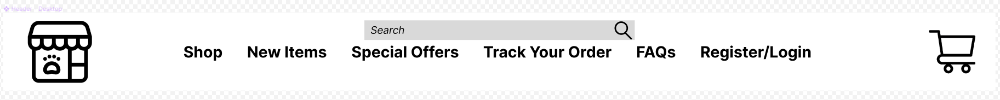
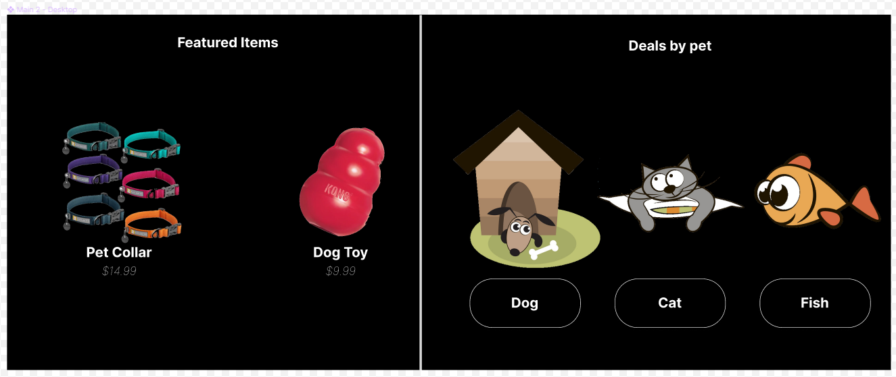

# Pet Store eCommerce - Project Structure

- Section 1 shows screenshots for each section.
- Section 2 describes the application layout.
- Section 3 described components and their props and states.

## Section 1 - App Screenshots
- Navigation bar screenshot:

- Main Window 1 screenshot:

- Main Window 2 screenshot:

- Footer screenshot:

## Section 2 - App Components Layout
- Navigation Bar
  - Nav Items
    - Item List:picture: 'Store Logo'
    - Item List:button : 'Shop'
    - Item List:button : 'New Items'
    - Item List:button : 'Special Offers'
    - Item List:button : 'Track Your Order'
    - Item List:button : 'FAQs'
    - Item List:button : 'Register/Login'
    - Item List:button : 'Shopping Cart'
  - Search bar
- Main Window
  - Button: 'Shop Now'
  - Section: 'Featured Items'
    - List of popular items to be displayed
      - Item List:picture: 'Product Picture'
      - Item List:text   : 'Product name'
      - Item List:text   : 'Product price'
  - Section: 'Deals by pet'
    - List of items organized by pet
      - Item List:picture: 'Pet picture (dog/cat/fish)'
      - Item List:text   : 'Pet type (dog/cat/fish)'
- Footer
  - Footer Items
    - Item List:text: 'Newsletter'
      - Input box: 'email'
      - Button: 'Subscribe'
    - Item List:text: 'Customer Service'
      - Item List:text   : 'Track an Order'
      - Item List:text   : 'About Us'
      - Item List:text   : 'FAQs'
      - Item List:text   : 'Contact Us'
    - Item List:text: 'Additional Services'
      - Item List:text   : 'Dog grooming'
      - Item List:text   : 'Dog wash'
      - Item List:text   : 'Daycare'
      - Item List:text   : 'Training'
    - Item List:text: 'Be in touch'
      - Item List:picture: 'Twitter Logo '
      - Item List:picture: 'Facebook Logo'
      - Item List:picture: 'Instagram Logo'

## Section 2 - Components Props and States
- Navigation Bar
  - Nav Items
    - **Props:**
      - List of Nav Items with options
      - Nav Item
        - **Props:**
          - Text to be displayed (caption)
          - Picture to be displayed (logo)
        - **State:**
          - Current selection
  - Search bar
    - **State:**
      - Input value to be search
- Main Window
  - Button
    - **Props:**
      - Text to be displayed (caption)
      - Picture to be displayed (logo)
    - **State:**
        - Current selection
  - Section: 'Featured Items'
    - List of popular items to be displayed
      - Popular Item
        - **Props:**
          - Product Picture
          - Product name
          - Product price
        - **State:**
          - Current selection
  - Section: 'Deals by pet'
    - List of items organized by pet
      - Item organized by pet
        - **Props:**
          - Pet picture (dog/cat/fish)
          - Pet type (dog/cat/fish)
        - **State:**
          - Current selection
- Footer
  - Footer section
    - **Props:**
      - Caption
      - List of options
      - Option
        - **Props:**
          - Text to be displayed (caption)
          - Picture to be displayed (logo)
          - Input box
          - Button
        - **State:**
          - Current selection
          - Input value from input box